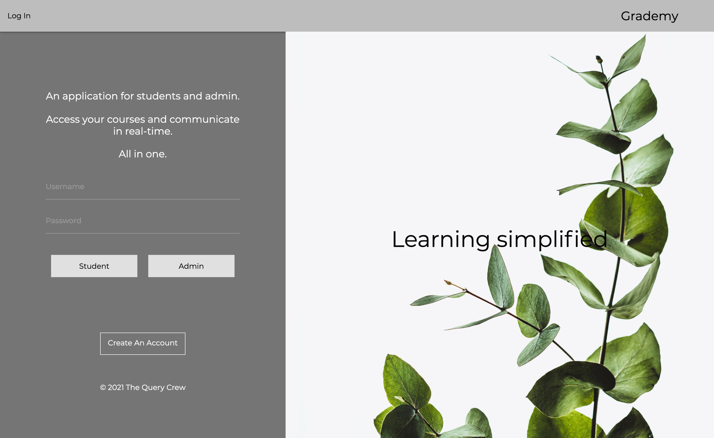
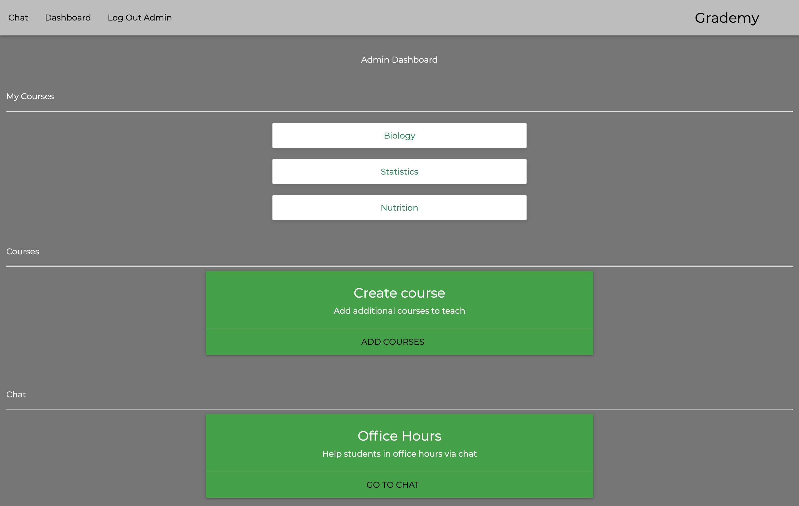
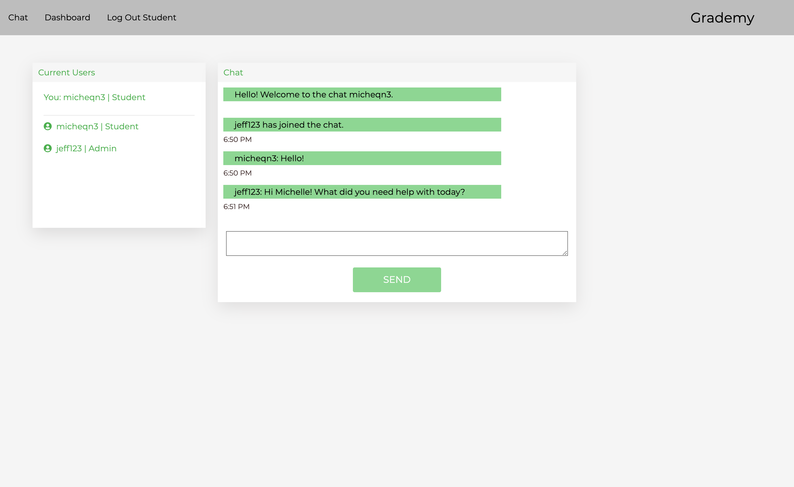

# Grademy

An all-in-one learning application for students and admin. Users are able to access their courses and 
communicate in real time through an integrated chat window.    
Student and admin accounts have a different functionality and have the ability to perform RESTful CRUD operations including: 

Admin Dashboard:
- View courses they are teaching 
- Create courses
- Update course descriptions
- Hold office hours through the chat

Student Dashboard:
- View courses they are currently enrolled in 
- Enroll in courses
- Drop courses 
- Ask other students/admins for help on assignments through the chat

### To execute the file: 

- Open in browser

### Link to deployed application:

https://grademy.herokuapp.com/

### Technologies/Languages used:

  - JavaScript
  - Node.js
  - Socket.io
  - Sequelize
  - Bcrypt
  - Connect-Session-Sequelize
  - Express
  - Express Session
  - Express Handlebars
  - MySQL2
  - Nodemon
  - Dotenv
  - Materialize

### Contributors:

* Michelle Nguyen https://github.com/micheqn3
* David Valderrama https://github.com/reddituser7777
* Alex DaRe https://github.com/aldare93
* Cheryth Dai https://github.com/ChengyuD

### Screenshot of deployed application:
Log In          |  
:-------------------------:|
   

Admin Dashboard           |  Student Dashboard
:-------------------------:|:-------------------------: 
  |  

Chat         |  
:-------------------------:|
   

### License 

MIT 
